Methods Reports: Campsites
================

This is a draft of a methods report for the campsite sweeps.

Overview:
---------

As houselessness in Portland and the surrounding area increases (see <http://www.portlandoregon.gov/toolkit/article/562206>, <http://ahomeforeveryone.net/>), questions arise about how data about vulnerable population is being recorded and used, and whose voices are represented in reporting systems. This collection takes a look at the data that is being recorded by the City of Portland about camping, and explores questions about unhoused people are being moved around Portland and what it means to have a sense of place in our city.

Camping, whether for recreation or for survival, is not permitted in the City of Portland (City Code 14A.50.020 and 14A.50.). To enforce this, the City posts signs 24 hours in advance of a campsite clean-up, or \`sweep'. Any property that remains after 24 hours is picked up and stored in a facility for 30 days.

The Homelessness/Urban Camping Impact Reduction Program (HUCIRP) reports intersections of all posted sweeps of campsites in a given week, and this visualization counts the total number of reported sweeps. Portland has had an average of 112.4 campsite sweeps per month, and the amount of sweeps has increased significantly over time.

The raw format of the data is in PDF bullet point lists, which is not searchable or mappable, available here: <http://www.portlandoregon.gov/toolkit/71771>. HUCIRP representatives informed us that the data is not mapped, unlike the public reports of campsites which can be viewed for a 12-week rolling window (<http://pdx.maps.arcgis.com/apps/TimeAware/index.html?appid=ac6a6abf1092482190984a5df9dfacb0>).

This project takes the raw PDF data, scrapes the information, and geocoded it into a single data set for analysis. In this format, patterns of sweeps over time and location can be explored, and the data can be compared with other data, such as the campsite reports, for comparison.

This methods report contains information on how the data was cleaned and prepared, as well as further analyses that support the visualizations provided in the Neighborhoods Collection 2018.

Cleaning Data
-------------

The One Point of Contact Weekly Campsite Reports is available for download from Portland's Homelessness Toolkit (<https://www.portlandoregon.gov/toolkit/71771>). The raw data is a PDF with a description of the campsite reports received for the week, including total reports received and (from March, 2017) an estimate of the number of unique campsites identified. The report contains a bullet point lists of intersections or descriptions of locations where campsites were posted and swept.

To code the data, the following variables were identified from within reports:

<table style="width:90%;">
<colgroup>
<col width="12%" />
<col width="77%" />
</colgroup>
<thead>
<tr class="header">
<th>Variable</th>
<th>Description</th>
</tr>
</thead>
<tbody>
<tr class="odd">
<td>ReportDate</td>
<td>Date of published police report (weekly; the date of report is the Monday of that 7-day week)</td>
</tr>
<tr class="even">
<td>CleanType</td>
<td>Cleaned = &quot;This Week we Cleaned&quot;; Planned (Next week we plan to clean); Future (Next Week/future plans)</td>
</tr>
<tr class="odd">
<td>Location</td>
<td>Location of the campsite (intersection, park, or description)</td>
</tr>
<tr class="even">
<td>Quadrant</td>
<td>City Quadrant (North, Northeast, Northwest, Southeast, Southwest)</td>
</tr>
<tr class="odd">
<td>MaintenanceProject</td>
<td>Is it a maintenance project? Y/N (Identified in original data with an asterisk, '*')</td>
</tr>
<tr class="even">
<td>Green Space</td>
<td>Y/N (green text or not in the original document identifies parks/natural areas)</td>
</tr>
<tr class="odd">
<td>Excessive.Heat.Cold</td>
<td>Y/N Weeks where clean-ups were delayed or cancelled due to weather are noted in the document</td>
</tr>
<tr class="even">
<td>Notes</td>
<td>This variable copies notes that were typed into the document with qualitative information about the location within &quot;&quot;; Notes without quotation marks are notes by the geocoder.</td>
</tr>
</tbody>
</table>

The text from the reports was copied from PDF to a table in .csv format, and taken into Excel. A fill-down was used to recognize strings ending in an asterisk to code Y/N in the Maintenance column. Green space was hand coded, and quadrant coded by a string search in the location field. The file was re-exported to .csv

### Geocoding

The following script was used to geocode the data set.

``` r
# Geocoding script for large list of addresses.

#load the ggmap library
library(ggmap)
register_google(key="ENTER_YOUR_KEY_HERE", account_type="standard")

# get the input data
infile <- "SweepsDataCoded_v03"
data <- read.csv(paste0('./', infile, '.csv'))

# get the address list, and append "Portland, OR" to the end to increase accuracy 
addresses = data$Location2
addresses = paste0(addresses, ", Portland, OR")

#define a function that will process googles server responses for us.
# Modified by kmb 04/05/2018 for Sweeps Dataset Geocoding and based on script by Shane Lynn 10/10/2013, https://www.shanelynn.ie/massive-geocoding-with-r-and-google-maps/

getGeoDetails <- function(address){   
  #use the gecode function to query google servers - default was 'all', I only need lat lon
  geo_reply = geocode(address, output='all', messaging=TRUE, override_limit=TRUE)
  #now extract the bits that we need from the returned list
  answer <- data.frame(lat=NA, long=NA, accuracy=NA, formatted_address=NA, address_type=NA, status=NA)
  answer$status <- geo_reply$status
  
  #if we are over the query limit - want to pause for an hour
  while(geo_reply$status == "OVER_QUERY_LIMIT"){
    print("OVER QUERY LIMIT - Pausing for 1 hour at:") 
    time <- Sys.time()
    print(as.character(time))
    Sys.sleep(60*60)
    geo_reply = geocode(address, output='all', messaging=TRUE, override_limit=TRUE)
    answer$status <- geo_reply$status
  }
  
  #return Na's if we didn't get a match:
  if (geo_reply$status != "OK"){
    return(answer)
  }   
  #else, extract what we need from the Google server reply into a dataframe:
  answer$lat <- geo_reply$results[[1]]$geometry$location$lat
  answer$long <- geo_reply$results[[1]]$geometry$location$lng   
  if (length(geo_reply$results[[1]]$types) > 0){
    answer$accuracy <- geo_reply$results[[1]]$types[[1]]
  }
  answer$address_type <- paste(geo_reply$results[[1]]$types, collapse=',')
  answer$formatted_address <- geo_reply$results[[1]]$formatted_address
  
  return(answer)
}

#initialise a dataframe to hold the results
geocoded <- data.frame()
# find out where to start in the address list (if the script was interrupted before):
startindex <- 1
#if a temp file exists - load it up and count the rows!
tempfilename <- paste0(infile, '_temp_geocoded.rds')
if (file.exists(tempfilename)){
  print("Found temp file - resuming from index:")
  geocoded <- readRDS(tempfilename)
  startindex <- nrow(geocoded)
  print(startindex)
}

# Start the geocoding process - address by address. geocode() function takes care of query speed limit.
for (ii in seq(startindex, length(addresses))){
  print(paste("Working on index", ii, "of", length(addresses)))
  #query the google geocoder - this will pause here if we are over the limit.
  result = getGeoDetails(addresses[ii]) 
  print(result$status)     
  result$index <- ii
  #append the answer to the results file.
  geocoded <- rbind(geocoded, result)
  #save temporary results as we are going along
  saveRDS(geocoded, tempfilename)
}

#add the latitude and longitude to the main data
data$lat <- geocoded$lat
data$long <- geocoded$long
data$accuracy <- geocoded$accuracy  

#write to the output files
saveRDS(data, paste0(infile ,"_geocoded.rds"))
write.table(data, file=paste0(infile ,"_geocoded.csv"), sep=",", row.names=FALSE)
```

The output adds the following variables to the data set. Accuracy was renamed 'Type'.

<table style="width:90%;">
<colgroup>
<col width="12%" />
<col width="77%" />
</colgroup>
<thead>
<tr class="header">
<th>Variable</th>
<th>Description</th>
</tr>
</thead>
<tbody>
<tr class="odd">
<td>lat</td>
<td>Latitude</td>
</tr>
<tr class="even">
<td>long</td>
<td>Longitude</td>
</tr>
<tr class="odd">
<td>type</td>
<td>The class of location that was geocoded by the Google Maps API (e.g. intersection, street address, route, establishment)</td>
</tr>
</tbody>
</table>

After the first pass through the Google Maps API, the dataset was checked extensively by hand. Many locations were unable to be geocoded by the Google Maps API due to the description of the location or intersection, and needed to be coded by hand. The following variables were geocoded into the data set after pulling the above variables from the PDFs to identify the latitude/longitudes that were manually corrected or manually geocoded.

Additionally, the data in this data set is represented as point data. Descriptions of areas or routes that would be polygons or lines were estimated as points either via a manual centroid estimate (e.g. for a park or natural area, or along a route), or by selecting one corner of a polygon (e.g. in a set of blocks).

<table style="width:90%;">
<colgroup>
<col width="12%" />
<col width="77%" />
</colgroup>
<thead>
<tr class="header">
<th>Variable</th>
<th>Description</th>
</tr>
</thead>
<tbody>
<tr class="odd">
<td>Estimated.geocode</td>
<td>Y/N If the Google Maps API could not locate a geocode, or if the geocoded location was identified by hand as incorrect, a by hand location was geocoded.</td>
</tr>
<tr class="even">
<td>Polygon.as.Point?</td>
<td>Y/N This data is recorded as point data. If an estimated geocoded reduced a polygon or line down to an estimated point location, this is Y.</td>
</tr>
</tbody>
</table>

Magnitude of Sweeps in Portland
-------------------------------

The Homelessness/Urban Camping Impact Reduction Program (HUCIRP) reports intersections of all posted sweeps of campsites in a given week, and this visualization counts the total number of reported sweeps.

Camping, whether for recreation or for survival, is not permitted in the City of Portland (City Code 14A.50.020 and 14A.50.). To enforce this, the City posts signs 24 hours in advance of a campsite clean-up, or \`sweep'. Any property that remains after 24 hours is picked up and stored in a facility for 30 days.

Let's take a look at the past 18 months of sweeps in our city.

Portland has had an average of 112.4 campsite sweeps per month. The amount of campsite sweeps significantly increased to a peak of 311 sweeps in one month during October, 2017. The past 8 months have all been above the average for sweeps, showing that the trend of rising sweeps is consistent.

The following code was used to aggregate data over time and by neighborhood.

### By Time

    ## 
    ## Attaching package: 'lubridate'

    ## The following object is masked from 'package:reshape':
    ## 
    ##     stamp

    ## The following object is masked from 'package:base':
    ## 
    ##     date

``` r
library(reshape)
library(lubridate) 
library(ggplot2)  
library(scales)   
library(gridExtra) 

dat<-read.csv(file="FILENAME",header=TRUE)
dat<- cbind(dat, as.Date(dat$ReportDate, "%m/%d/%y"))
colnames(dat)[colnames(dat)=="as.Date(dat$ReportDate, \"%m/%d/%y\")"] <- "NewReportDate"
```

Aggregate the data by month and week:

``` r
dat.w.agg <-  aggregate(Location~NewReportDate,FUN=length,data=dat)

ReportDate2 <- as.Date(dat$NewReportDate)
short.date = strftime(ReportDate2, "%Y-%m")
dat.m.agg = aggregate(Location~short.date, FUN = length, data=dat)
```

What is average number of sweeps per week? Per month?

    ## [1] "By Week, average and median:"

    ## [1] 24.7033

    ## [1] 22

    ## [1] "By Month, average and median:"

    ## [1] 112.4

    ## [1] 113

Line and Bar Charts

``` r
#Aggregate the data by month/by week
dat.w.agg <-  aggregate(Location~NewReportDate,FUN=length,data=dat)

#short.date = strftime(dat$ReportDate, "%m/%y")
dat.m.agg = aggregate(Location~short.date, FUN = length, data=dat)

#Weeks
WeekPlot <- ggplot(dat.w.agg, aes(NewReportDate, Location)) +
           geom_point(na.rm=TRUE, color="darkblue")+
           ggtitle("Campsite Clean-ups/Sweeps  \n 2016-2018  By Week") +
           xlab("Date") + ylab("Number of Sites Cleaned") +
           scale_x_date(labels=date_format(format="%m-%d-%y"), breaks = date_breaks("month"))+
           theme(axis.text.x=element_text(angle=90,hjust=1)) +
           stat_smooth(colour="green")

WeekPlot
```

    ## `geom_smooth()` using method = 'loess'

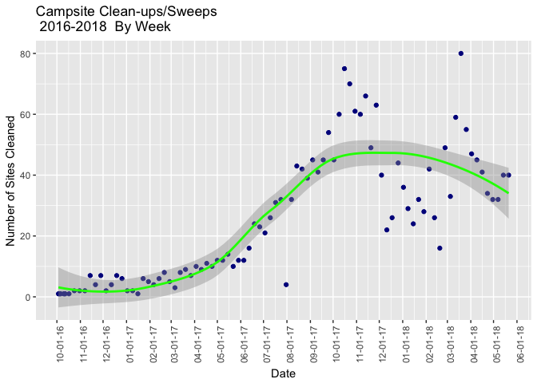

``` r
WeekPlot2 <- ggplot(dat.w.agg, aes(NewReportDate, Location)) +
           geom_bar(stat="identity", color="darkblue")+
           scale_x_discrete(expand=c(5, 0)) +
           ggtitle("Campsite Clean-ups/Sweeps  \n 2016-2018  By Week") +
           xlab("Date") + ylab("Number of Sites Cleaned") +
           scale_x_date(labels=date_format(format="%b-%Y"), breaks = date_breaks("month")) +
           theme(axis.text.x=element_text(size  = 10,
                                angle = 45,
                                hjust = 1,
                                vjust = 1))
```

    ## Scale for 'x' is already present. Adding another scale for 'x', which
    ## will replace the existing scale.

``` r
WeekPlot2
```

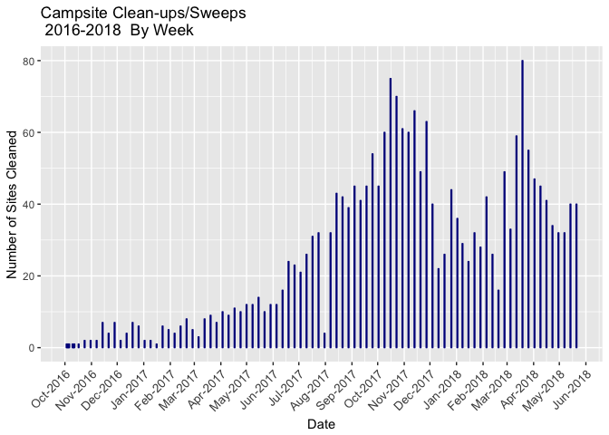

``` r
#Months
MonthPlot <- ggplot(dat.m.agg, aes(short.date, Location)) +
           geom_point(na.rm=TRUE, color="darkblue")+
           #scale_x_discrete(expand=c(5, 0)) +
           ggtitle("Campsite Clean-ups/Sweeps  \n 2016-2018  By Month") +
           xlab("Date") + ylab("Number of Sites Cleaned") +
           #scale_x_date(labels=date_format(format="%b-%Y"), breaks = date_breaks("month")) +
           theme(axis.text.x=element_text(size  = 10,
                                angle = 45,
                                hjust = 1,
                                vjust = 1)) +
           stat_smooth(colour="green")
MonthPlot
```

    ## `geom_smooth()` using method = 'loess'

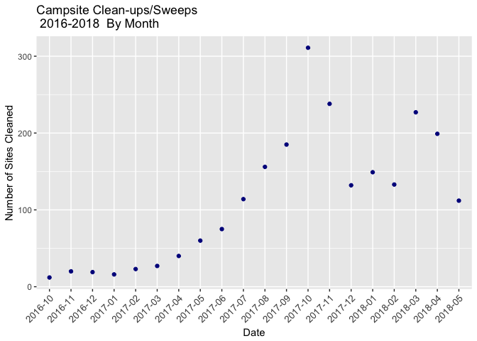

``` r
MonthPlot2 <- ggplot(dat.m.agg, aes(short.date, Location)) +
           geom_bar(stat="identity", fill="darkblue")+
           #scale_x_discrete(expand=c(5, 0)) +
           ggtitle("Campsite Clean-ups/Sweeps  \n 2016-2018  By Month") +
           xlab("Date") + ylab("Number of Sites Cleaned") +
           #scale_x_date(labels=date_format(format="%b-%Y"), breaks = date_breaks("month")) +
           theme(axis.text.x=element_text(size  = 10,
                                angle = 45,
                                hjust = 1,
                                vjust = 1))

MonthPlot2
```

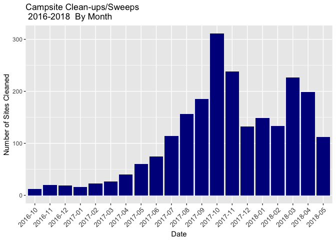

    ## Saving 7 x 5 in image

    ## `geom_smooth()` using method = 'loess'

    ## Saving 7 x 5 in image
    ## Saving 7 x 5 in image

    ## `geom_smooth()` using method = 'loess'

    ## Saving 7 x 5 in image

### By Neighborhood

``` r
library(RPostgres)
library(DBI)

pw<- {
  "ENTER_PASSWORD_HERE"
}

con <- dbConnect(RPostgres::Postgres()
                 , host='host'
                 , port='port'
                 , dbname='dbname'
                 , user='user'
                 , password=pw)

rm(pw) # removes the password
```

Import neighborhoods:

``` sql

SELECT  *
FROM    rlis_neighborhoods;
```

Import camp clean-ups:

``` sql

SELECT  *
FROM    camp_sweeps;
```

Join camps inside neighborhoods:

``` sql
select 
camp_sweeps.*,
rlis_neighborhoods.name
from rlis_neighborhoods
JOIN camp_sweeps ON ST_intersects (rlis_neighborhoods.geom, camp_sweeps.geom)
```

Aggregate:

``` r
#Total sweeps by neighborhood
dat.camps.neigh.agg = aggregate(location~name, FUN = length, data=dat.camps.neigh)

#subset out the neighborhoods with 4 sweeps or less (for simplicity, for now):
dat.neigh.agg2 = dat.camps.neigh.agg[dat.camps.neigh.agg$location>4,]
dat.neigh.agg3 = dat.neigh.agg2[order(dat.neigh.agg2$location, decreasing=FALSE),]

#Bar charts 
NeighPlot2 <- ggplot(dat.neigh.agg3, aes(name, location)) +
           geom_bar(stat="identity", fill="firebrick4", width=1, position = position_dodge(width = 0.9))+
           coord_flip() +
          scale_x_discrete(limits = dat.neigh.agg3$name) +
          #scale_y_discrete(expand=c(5, 0)) + 
          ggtitle("Campsite Clean-ups/Sweeps Oct 2016 - Mar 2018 \n  By Neighborhood (Incl. only greater than 4 sweeps)") +
           xlab("Neighborhood") + ylab("Number of Sites Cleaned") +
           theme(axis.text.y=element_text(size  = 6,
                                angle = 20,
                                hjust = 1,
                                vjust = 1))

NeighPlot2
```

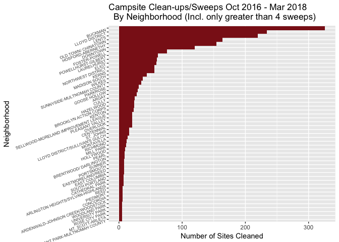

Campsite Reports and Sweeps
---------------------------

Are reports and responses consistent over time?
-----------------------------------------------

### Contextual Description:

HUCIRP operates a public reporting system for campsite locations, with a map visualization of all public reports over the last 12 weeks (LINK). This section explores the total quantity of reports from the public compared to the amount of unique campsites that were reported, and then looks at HUCIRP's clean-up response to public reports (the number of sweeps).

Notice that the number of estimated campsites remains consistent over time, while the number of campsite sweeps has increased over time.

The following code analyzes these two datasets.

Load campsite report data set

``` r
dat2<-read.csv(file="FILENAME",header=TRUE)

dat2<- cbind(dat2, as.Date(dat2$Date.Created, "%m/%d/%y"))
colnames(dat2)[colnames(dat2)=="as.Date(dat2$Date.Created, \"%m/%d/%y\")"] <- "NewReportDate"
```

Second, aggregate the reports data by month and week:

``` r
week.date = strftime(dat2$Date.Created, "%m/%d/%y")
dat2.w.agg <-  aggregate(lon~week.date,FUN=length,data=dat2)

ReportDate3 <- as.Date(dat2$Date.Created)
short.date2 = strftime(ReportDate3, "%Y-%m")
dat2.m.agg = aggregate(lon~short.date2, FUN = length, data=dat2)
```

What is average number of reports per week? Per month?

    ## [1] "By Week, average and median:"

    ## [1] 38.73908

    ## [1] 29

    ## [1] "By Month, average and median:"

    ## [1] 1131.448

    ## [1] 733

Line and Bar Charts for reports:

``` r
#Months
MonthPlot <- ggplot(dat2.m.agg, aes(short.date2, lon)) +
           geom_point(na.rm=TRUE, color="darkblue")+
           #scale_x_discrete(expand=c(5, 0)) +
           ggtitle("Campsite Reports  \n 2015-2018  By Month") +
           xlab("Date") + ylab("Number of Sites Reported") +
           #scale_x_date(labels=date_format(format="%b-%Y"), breaks = date_breaks("month")) +
           theme(axis.text.x=element_text(size  = 10,
                                angle = 45,
                                hjust = 1,
                                vjust = 1)) +
           stat_smooth(colour="green")
MonthPlot
```

    ## `geom_smooth()` using method = 'loess'

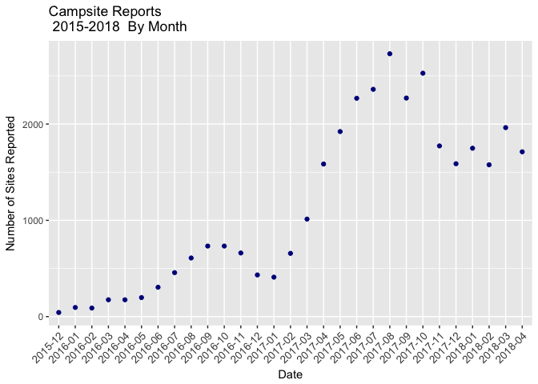

``` r
MonthPlot2 <- ggplot(dat2.m.agg, aes(short.date2, lon)) +
           geom_bar(stat="identity", fill="darkblue")+
           #scale_x_discrete(expand=c(5, 0)) +
           ggtitle("Campsite Reports  \n 2015-2018  By Month") +
           xlab("Date") + ylab("Number of Sites Reported") +
           #scale_x_date(labels=date_format(format="%b-%Y"), breaks = date_breaks("month")) +
           theme(axis.text.x=element_text(size  = 10,
                                angle = 45,
                                hjust = 1,
                                vjust = 1))

MonthPlot2
```

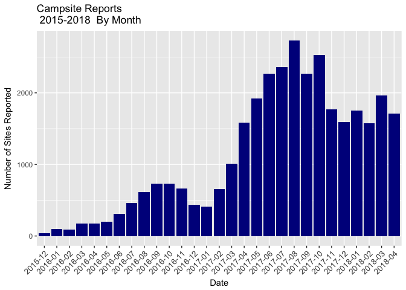

### Compare Campsite Reports vs Sweeps

``` r
colnames(dat2.m.agg)[colnames(dat2.m.agg)=="short.date2"]<-"short.date"


comb <- merge(dat2.m.agg, dat.m.agg, by="short.date")
comb2 <- melt(comb)
```

    ## Using short.date as id variables

``` r
MonthPlotcomb <- ggplot(comb2, mapping=aes(short.date, value, fill=variable)) +
           geom_bar(stat="identity") +
           #geom_bar(aes(lon, fill="darkblue"), stat="identity")+
           #geom_bar(data=Location, fill="orange", stat="identity") +
           #scale_x_discrete(expand=c(5, 0)) +
           ggtitle("Campsite Reports  \n 2015-2018  By Month") +
           xlab("Date") + ylab("Number of Sites Reported") +
           #scale_x_date(labels=date_format(format="%b-%Y"), breaks = date_breaks("month")) +
           theme(axis.text.x=element_text(size  = 10,
                                angle = 45,
                                hjust = 1,
                                vjust = 1))

MonthPlotcomb
```

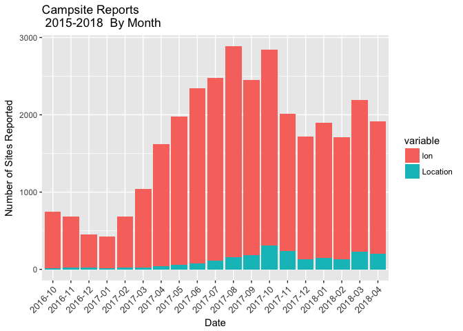

Linear Model comparing campsite sweeps vs campsite reports, for the dates available

``` r
newsweep<-dat.m.agg[1:19,]
newrep<- dat2.m.agg[11:29,]

plot2<-plot(newsweep$Location, newrep$lon)
abline(lm(newrep$lon~newsweep$Location), col="red")
lines(lowess(newsweep$Location,newrep$lon), col="blue")
```

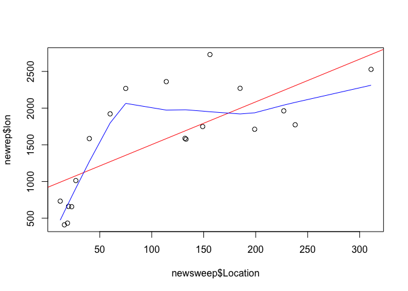

``` r
model <- lm(newrep$lon~newsweep$Location)
summary(model)
```

    ## 
    ## Call:
    ## lm(formula = newrep$lon ~ newsweep$Location)
    ## 
    ## Residuals:
    ##    Min     1Q Median     3Q    Max 
    ## -604.3 -371.9 -118.2  351.6  910.3 
    ## 
    ## Coefficients:
    ##                   Estimate Std. Error t value Pr(>|t|)    
    ## (Intercept)        921.213    193.598   4.758 0.000182 ***
    ## newsweep$Location    5.819      1.357   4.288 0.000498 ***
    ## ---
    ## Signif. codes:  0 '***' 0.001 '**' 0.01 '*' 0.05 '.' 0.1 ' ' 1
    ## 
    ## Residual standard error: 519.4 on 17 degrees of freedom
    ## Multiple R-squared:  0.5196, Adjusted R-squared:  0.4913 
    ## F-statistic: 18.38 on 1 and 17 DF,  p-value: 0.000498

Of the reports, how many estimated campsites did the city report? How many did they sweep? 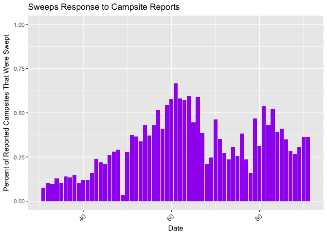

But, have the number of campsites increased over time?

``` r
library(astsa)
asdate = strptime(percent2$Date, "%m/%d/%y")
percent3<-cbind(percent2,asdate)

fit <- lm(percent3$EstimatedSites ~ percent3$asdate)
summary(fit)
```

    ## 
    ## Call:
    ## lm(formula = percent3$EstimatedSites ~ percent3$asdate)
    ## 
    ## Residuals:
    ##     Min      1Q  Median      3Q     Max 
    ## -15.117  -5.312  -1.770   3.638  71.737 
    ## 
    ## Coefficients:
    ##                   Estimate Std. Error t value Pr(>|t|)    
    ## (Intercept)     -7.658e+02  2.142e+02  -3.575 0.000706 ***
    ## percent3$asdate  5.785e-07  1.420e-07   4.074 0.000140 ***
    ## ---
    ## Signif. codes:  0 '***' 0.001 '**' 0.01 '*' 0.05 '.' 0.1 ' ' 1
    ## 
    ## Residual standard error: 11.81 on 59 degrees of freedom
    ## Multiple R-squared:  0.2196, Adjusted R-squared:  0.2064 
    ## F-statistic:  16.6 on 1 and 59 DF,  p-value: 0.0001396

``` r
plot(percent3$asdate, percent3$EstimatedSites)
abline(fit)
```

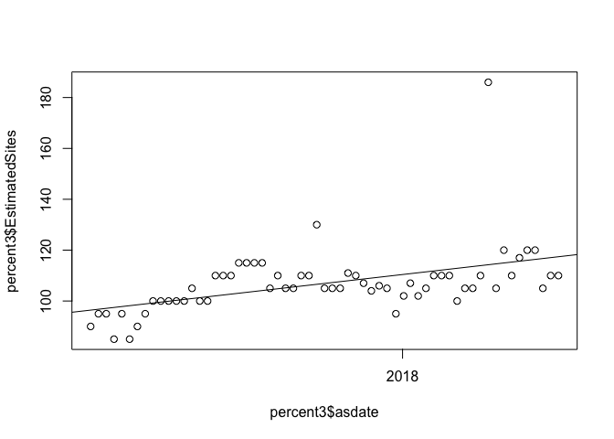

Estimate of impact/Number of campers impacted by sweeps
-------------------------------------------------------

With an average of 5.8 people per campsite, and an average of 24.7 sweeps per week, up to 143 people are being displaced on average each week.

The 2017 Point-in-Time count estimates that 1,668 people are unsheltered on any given night, so around 8.5% (143/1668) of unsheltered people are being affected by campsite sweeps per week.

The following code calculates the average number of campers impacted by sweeps.

``` r
#Subset of dataset by reports with estimates of number of campers
sub<-read.csv(file="FILENAME",header=TRUE)
  colnames(sub)<-betternames
```

Average number of people reported per campsite (descriptive statistics), with outlier removal before mean:

``` r
library(outliers)

#outlier(sub$NumCampters_int)
#min(sub.noout$NumCampters_int)
#max(sub.noout$NumCampters_int)

mine<-boxplot(sub$NumCampters_int)
outliers<-mine$out
#mine$names
#mine$stats

#min(outliers)
sub.noout<-sub[sub$NumCampters_int<22.5,]

boxplot(sub.noout$NumCampters_int)
summary(sub.noout$NumCampters_int)
```
